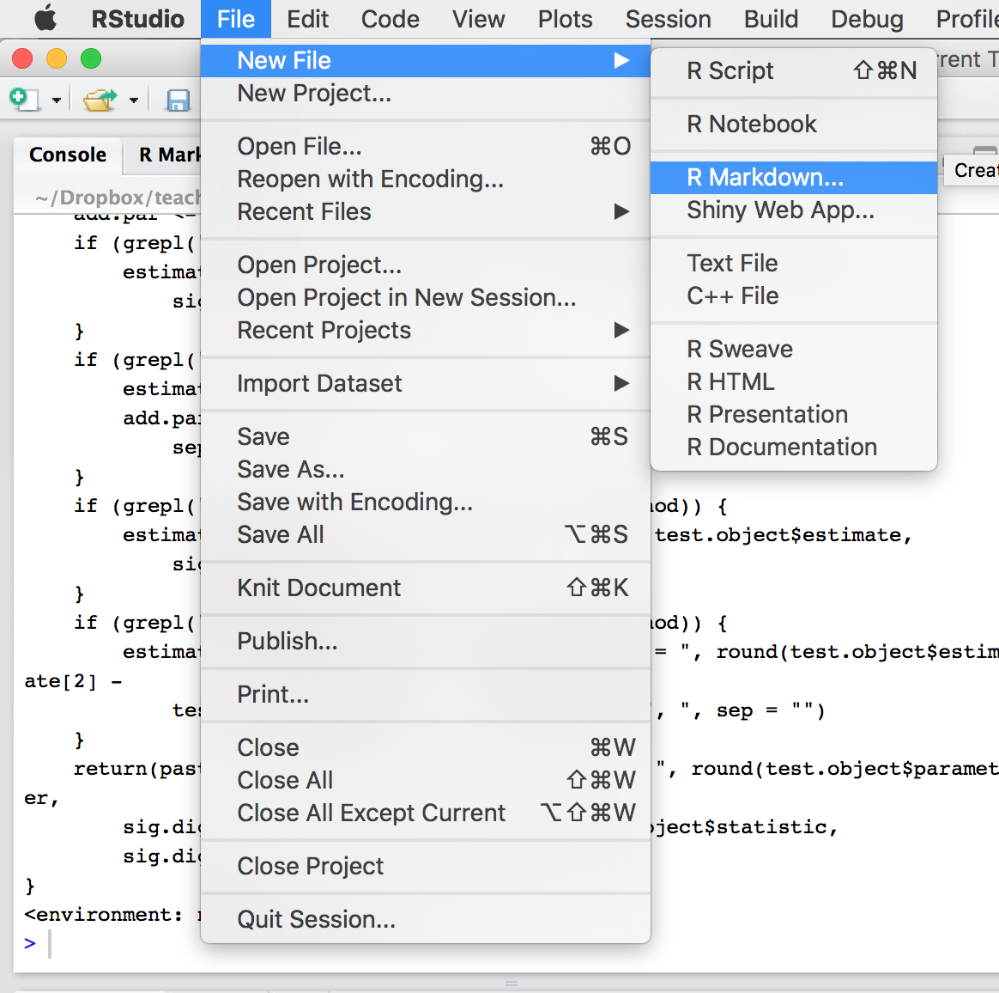
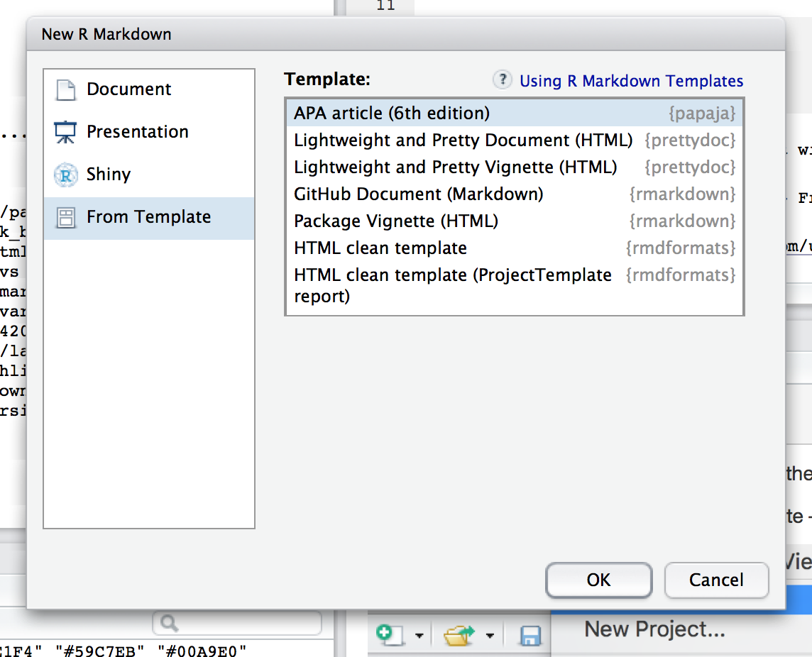
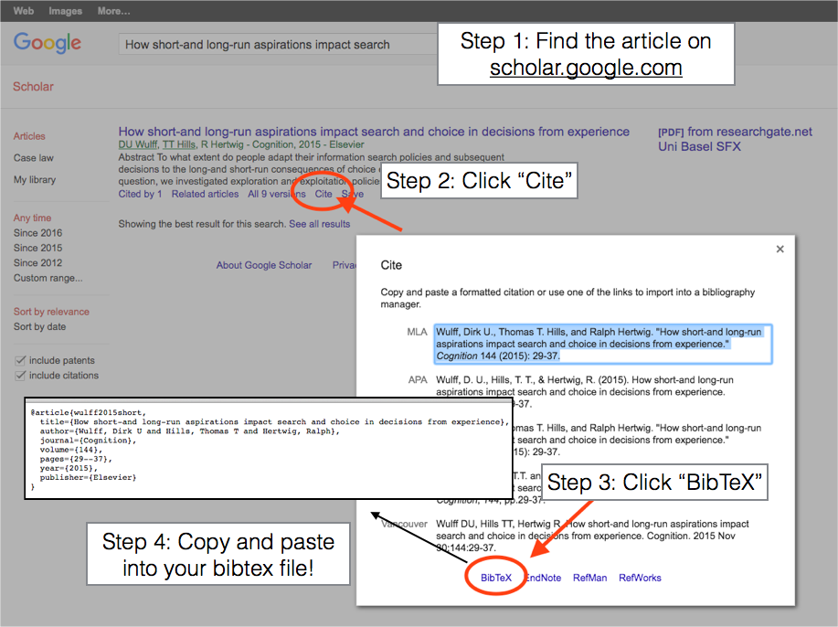
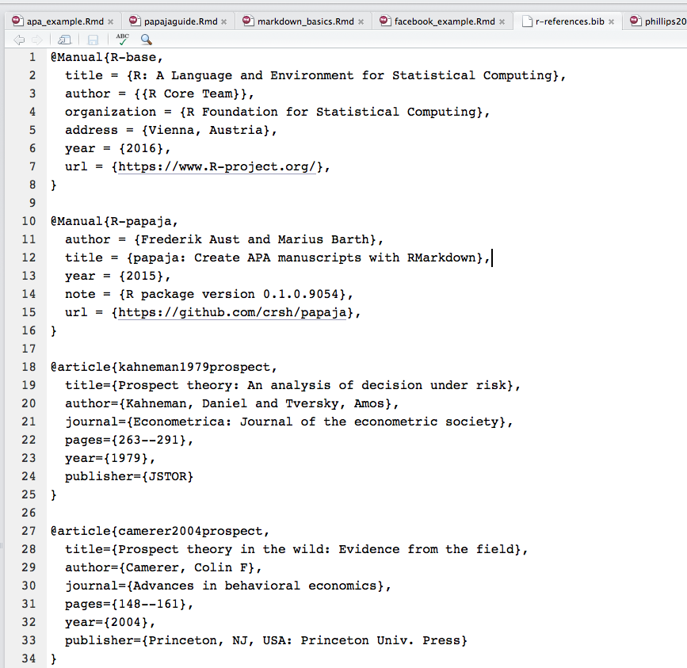

<hr>

[Visit my website](http://trefoil.ml/) for more like this!

__References__

Most of this material is borrowed from:

* [This document](https://raw.githubusercontent.com/crsh/papaja/master/example/example.pdf); and 

* [The papaja GitHub Page](https://github.com/crsh/papaja)
______________________________________________________________________________________________________________________________________

## Intstallation of the needed tools
In this part of the courses, we’ll go over how to create APA style documents with Markdown and `papaja`. `papaja` (short for Preparing APA Journal Articles) is an R package that, combined with R Markdown, takes care of all the terribly tedious aspects of APA style, from layout to citations, and allows you to focus on your writing and analysis.

### Get the latest versions of RStudio and R
RStudio and R are constantly being updated with bug fixes and additional features. As of now, RStudio is at v1.0.44 and R is at version v3.3.2. If you have a version much older than these, I recommend you update them.

### Install TeX
In order to create PDF documents from `papaja`, you need to have a TeX distribution installed on your computer. Go to one of the following links and install the latest version to your computer.

Windows: [MikTeX](https://miktex.org/)

Mac: [MacTeX](http://www.tug.org/mactex/)

Note: Be sure to restart RStudio after installing TeX to make sure RStudio knows it’s there (now).

### Install papaja

Next, install the `papaja` R package from GitHub:

```{r}
# Install the papaja R package from GitHub
# install.packages("devtools")   # In case you don't have devtools installed
# devtools::install_github("crsh/papaja")
library(papaja)
```

## Get started with the APA-template

Now it’s time to write your APA style document using `papaja`! It’s best to start by opening a template. Here are two templates free for download: 

[A .Rmd short APA style report](https://dl.dropboxusercontent.com/u/7618380/phillips2017apa.Rmd).

[Here is the bibliography file](https://dl.dropboxusercontent.com/u/7618380/phillips2017apa_references.bib)

[A .Rmd APA style tutorial on papaja](https://dl.dropboxusercontent.com/u/7618380/apa_example.Rmd).

[Here is the bibliography file](https://dl.dropboxusercontent.com/u/7618380/r-references.bib)

You can also open the default APA template in Markdown by clicking the following in RStudio: File – New File – R Markdown… – From Template – APA Article (6th Edition)


<div style="width:360px; height=250px">
<center></center>
</div>

You’ll see the following window show up. You can change the title or author of your document here, as well as the output format. However, you can also change all of these later. Just click ok.


<div style="width:360px; height=250px">
<center></center>
</div>


Now, you should see a new blank markdown document open like this one:


<center></center>


As you can see, the new document will already have some text in it to help you get started.

### Update the main info

At the top of the document you’ll see several entries that have to do with the basic information about the document, from the title, to the short-title (aka, the running header), to author names, and affiliations. Go ahead and update the entries in these fields to correspond to your paper.

### Add/update a bibtex file
In order to cite articles, you need to have a separate bibliography file called `references.bib` (or you can call it something else as long as it has the .bib ending). To create a new .bib file in RStudio, click File – New File – Text File. This should open a new blank file in RStudio. Now save the file as `references.bib`.

Your `references.bib` file must contain all of your references in BibTeX format. BibTeX format is just a way of defining an article’s citation information (name, authors, year, journal etc.) in a standardized way. You need to add the BibTeX reference for every article you want to cite to your `references.bib` file. You can get BibTeX references easily from Google Scholar. To do this, go to scholar.google.com, and search for an article. When you find your article, click the “cite” button just under it. This will open up a citation window with many different citation styles. However, we don’t want these, we want the BibTeX citation. To get this, click the BibTeX button. When you do, a new window will open with several lines of text starting with a header. For example, here is the BibTeX file for Kahneman & Tversky (1979):

```
@article{kahneman1979prospect,
  title={Prospect theory: An analysis of decision under risk},
  author={Kahneman, Daniel and Tversky, Amos},
  journal={Econometrica: Journal of the econometric society},
  pages={263--291},
  year={1979},
  publisher={JSTOR}
}
```

Now you need to add this BibTeX reference to your `references.bib` file. To do this, just copy the BibTeX reference from Google Scholar, and paste it into your `references.bib` file. Then save the file! Now that the BibTeX entry is saved in your `references.bib` file, you can reference this article in your paper!

<div style="width:360px; height=250px">
<center></center>
</div>

Here is a screenshot of an example bibtex file. As you can see, it’s just a collection of several BibTeX entries copied and pasted from google Scholar. You can see the original file [here](https://dl.dropboxusercontent.com/u/7618380/r-references.bib).

<div style="width:360px; height=250px">
<center></center>
</div>

### Tell Markdown the name and location of your bibliography file!

You need to tell your Markdown file the name and location of your `references.bib` file for your citations to work. To do this, I recommend saving the `references.bib` file in the same folder as your `.Rmd` file. Then, make sure to update the name of the bibliography file in the appropriate field at the top of your .Rmd document. If you don’t give the correct name of the bibliography file, or if it is saved in another location than the folder with your .Rmd document, your references and citations won’t be included.


### Cite articles

To cite an article contained in your `bibliography.bib` file in your text, you need to know its title in your `references.bib` file. These titles are almost always in the format NameYearTitle and occur in the first line just after @article{. Once you have a title, use the @TITLE notation. To cite a number of articles in parentheses, put @TITLE in brackets. For example, in the following paragraph, I will cite a few papers using @TITLE.

Prospect theory, originally developed by Kahneman and Tversky (1979), has been used to explain many real-world decisions (e.g.; Camerer 2004; List 2004).

Once you cite an article using @TITLE, the entire reference in APA style will automatically be added to the bibliography!

For more tips on citations with R Markdown, check out [this web page](http://rmarkdown.rstudio.com/authoring_bibliographies_and_citations.html)

### Write your article

Thankfully, `papaja` will take care of (almost) all of your APA formatting needs. Just focus on the basics. Create the main sections Method, Results, Discussion, using 1st level headers (#), and subsections like Participants, Procedure with 2nd level headers (##). Change font types to italic or bold with asterixes.

### Add R chunks
You add R chunks and inline code to a document using basic Markdown. Check out [these examples](https://dl.dropboxusercontent.com/u/7618380/phillips2017apa.Rmd) and the `rmarkdown` lesson.

### Use papaja’s helpful functions

papaja contains many helpful functions that will allow you to create apa style figures and tables. For example, the `apa_table()` function will format matrices and dataframes according to APA guidelines.

### apa.table()
The `apa_table()` function will automatically convert a matrix or a dataframe to an APA style Table. For example, in the chunk below, I’ll create a table of summary statistics and then print the results as an APA style table.

```{r, results='asis'}
library(dplyr)

# Calculate summary statistics
chicken.summary <- ChickWeight %>% group_by(Diet) %>%
  summarise(
    "Mean Weight" = mean(weight),
    "SD Weight" = sd(weight)
  )

# Print table in APA format

papaja::apa_table(chicken.summary, caption = "Summary statistics of chicken weights by Diet")


```

**Important!!!** To get your Table to be included in the final PDF, you need to include the results='asis' argument in the chunk options. If you don’t do this, the table will be printed as commented LaTeX code in your final document. To be honest I’m not totally sure why you need to do this, I just learned it by trial-and-error.


### apa.print()

The `apa.print()` function will convert the results of a basic hypothesis test object (like a t-test or correlation test) to APA style output you can then use in an inline chunk. For example, in the following chunk I’ll create a hypothesis test object:

```{r}
weight.aov <- aov(weight ~ Diet, data = ChickWeight)
weight.aov
```

Once you have a hypothesis test object, you can print specific results by running papaja::apa_print(object). This function will return a list of different output formats. To see them all, run the function:


```{r}
papaja::apa_print(weight.aov)

```

In order to select a specific output format, select it by name using $\$$. For example, I can select the full result for the Diet factor by adding  `$full_results$Diet` to the result. Together, I will use the following inline code: The ANOVA was significant  `papaja::apa_print(weight.aov)$full_result$Diet`.

The ANOVA was significant `r papaja::apa_print(weight.aov)$full_result$Diet`


### Knit the document!
To create a real APA document from your R Markdown file, you need to knit it. Knitting a document simply means converting R Markdown code to a formatted document (in our case, and APA formatted pdf document). You can knit a document by clicking the “Knit” button at the top of your screen. Alternatively, you can use the Shift + Command + K hotkey on a Mac.

When you knit a document, you should see a bunch of processing code show up in your Console. This is totally normal. If everything is ok, then you should see your new APA style document show up in a new window! However, if there is an problem in your document, either in your R code or in your Markdown, you will see an error and the final document won’t knit. The most common reason why your document won’t knit is because you have an error in your R code.


